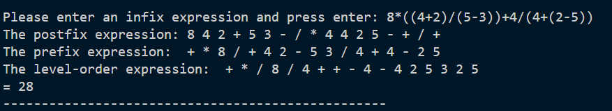
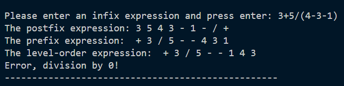
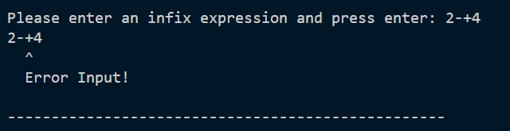
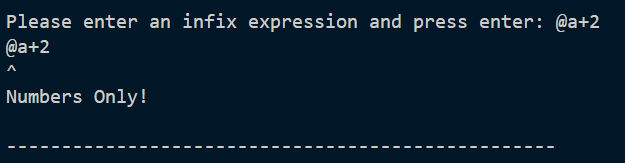

# HW3 Infix Expression Tree
<!-- **以下說明用矩陣A、B為例** -->

> * ***[Struct 宣告](#struct-宣告)***
> * ***[主要 function 功能](#主要function功能)***
> * ***[輸入格式與說明](#輸入格式與說明)***

---
## Struct 宣告
```c
存放樹的節點
typedef struct Tree{
     struct Tree* leftchild;
     struct Tree* rightchild;
     char data;
}treenode;
```
---
## 主要function功能
```c
treenode* addNode(char data)

> 新增一個節點內含 data
```
```c
char Cpop(char* stack, int* top)
treenode* Npop(treenode** stack, int* top)

> 進行 stack 的 pop 動作
```
```c
void Cpush(char* stack, int* top, int maxsize, char data)
void Npush(treenode** stack, int* top, treenode* root)

> 進行 stack 的 push 動作
```
```c
char Cpeek(char* stack, int* top)
treenode* Npeek(treenode** stack, int* top)

> 回傳 stack 最上面的 data
```
```c
void convert2postfix(treenode* root, int len, char** result, int* count)

> 將以 infix 表達的運算式字串轉為 postfix
```
```c
treenode* InfixExpressionTree(char* expression)

> 將以 infix 表達的運算式字串存成 Expression Tree
```
```c
int posteval(char* expression)

> 傳入一以 postfix 表達的運算式字串算出結果
```

---
## 輸入格式與說明
> * 輸入一 infix 運算式(只含小於10的整數、括號、加減乘除且沒有空格)，如不符合算式規定將跳出錯誤訊息(未知符號、不成對括號、括號中沒有運算式、運算式不符合infix form)  
> * 程式逐行輸出 postfix expression, prefix expression, level-order expression, 運算結果。如運算式中有除以0的部分，跳出錯誤訊息
> * 按 ctrl+c 或 esc 鍵(mac) 跳出程式
#### Result


#### Division by zero


#### Error Input



***[menu](#hw3-infix-expression-tree)*** 
