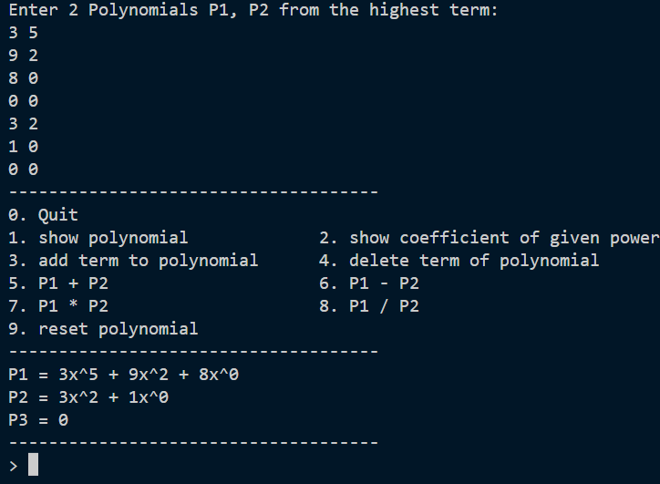
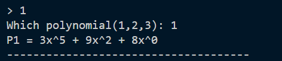
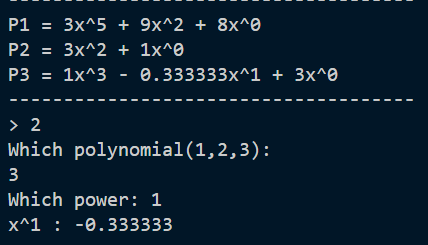
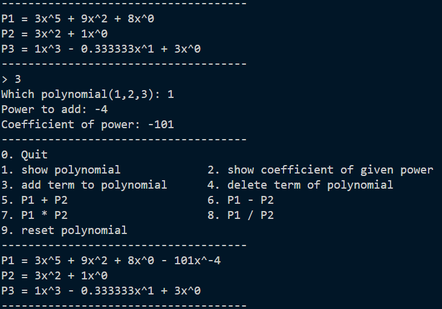
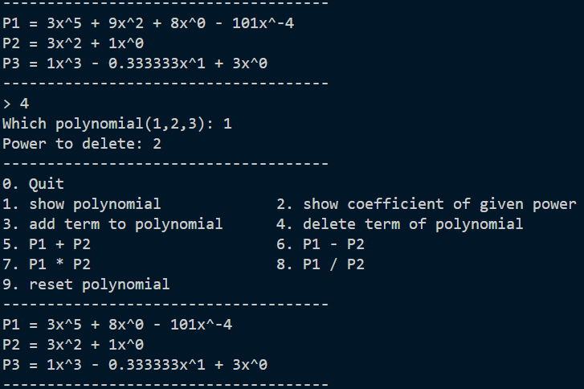
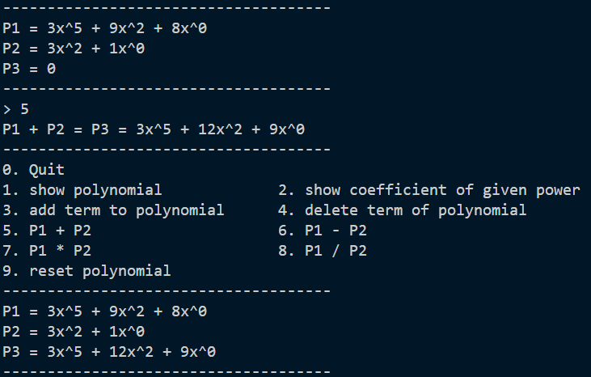
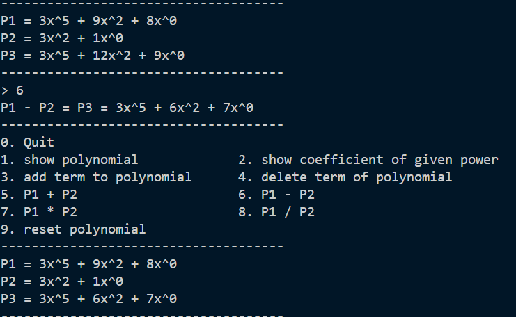
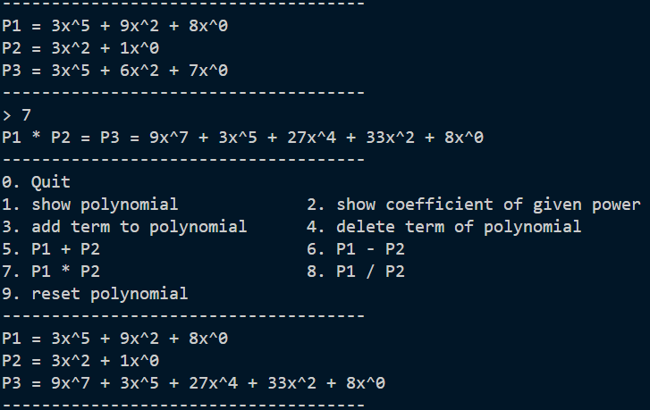
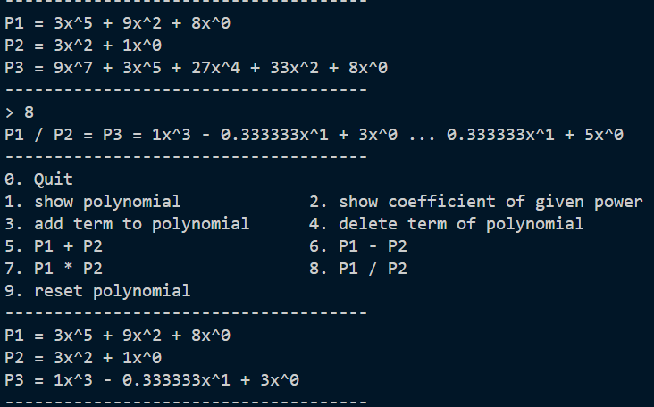
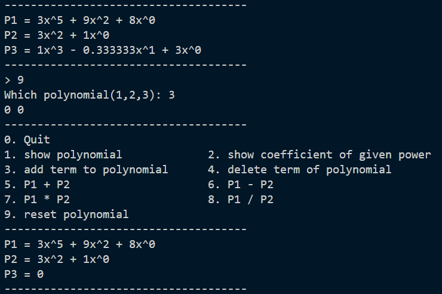

# HW2 POLYNOMIAL 
> 以 circular linked list 實作多項式加減乘除等操作。可使用浮點數係數與負次方

* ***[Struct 宣告](#struct-宣告)***
* ***[輸入格式與說明](#輸入格式與說明)***
  * ***[Show polynomial](#1-show-polynomial)***
  * ***[Show coefficient of given power](#2-show-coefficient-of-given-power)***
  * ***[Add term to polynomial](#3-add-term-to-polynomial)***
  * ***[Deleter term of polynomial](#4-delete-term-of-polynomial)***
  * ***[Polynomial addition](#5-polynomial-addition)***
  * ***[Polynomial subtraction](#6-polynomial-subtraction)***
  * ***[Polynomial multiplication](#7-polynomial-multiplication)***
  * ***[Polynomial division](#8-polynomial-division)***
  * ***[Reset polynomial](#9-reset-polynomial)***

## Struct 宣告
```c
typedef struct Node{
    int expo;
    double coeff;
    struct Node *next;
}node;
```
---
## 輸入格式與說明
> * 程式包含兩個多項式 P1 & P2，程式執行時須先進行輸入
> * 多項式輸入由高次方到低次方，輸入項數時個格式是 coeff power，中間用空格分開。結尾輸入 "0 0" 表示該多項式輸入結束
> e.g. "3 2" 就表示 3x^2
> * 直接輸入指令相對應的數字來進行該指令，如 要跳出程式，則輸入 0



**範例輸入:**  
P1: 3x^5 + 9x^2 + 8  
P2: 3x^2 + 1
```c
3 5
9 2
8 0
0 0
3 2
1 0
0 0
```
---

#### 0. Quit
> 結束程式
#### 1. Show polynomial
***[menu](#hw2-polynomial)*** 
> 輸入多項式編號(1, 2, 3)，以降冪顯示該多項式



#### 2. Show coefficient of given power
***[menu](#hw2-polynomial)*** 
> 輸入多項式編號與所尋找的次方，顯示多項式中該次方項的係數



#### 3. Add term to polynomial
***[menu](#hw2-polynomial)*** 
> 輸入多項式編號、要插入的次方項以及係數




#### 4. Delete term of polynomial
***[menu](#hw2-polynomial)*** 
> 輸入多項式編號以及要刪除的項數次方



#### 5. Polynomial addition
***[menu](#hw2-polynomial)*** 
> 顯示 P1 + P2 並將結果同時存入 P3




#### 6. Polynomial subtraction
> 顯示 P1 - P2 並將結果同時存入 P3



***[menu](#hw2-polynomial)*** 

#### 7. Polynomial multiplication
> 顯示 P1 * P2 並將結果同時存入 P3



***[menu](#hw2-polynomial)*** 

#### 8. Polynomial division
> 顯示 P1 / P2 的商和餘數，並將商存入 P3



***[menu](#hw2-polynomial)*** 

#### 9. Reset polynomial
> 輸入多項式編號，重新輸入多項式並覆蓋原本內容




