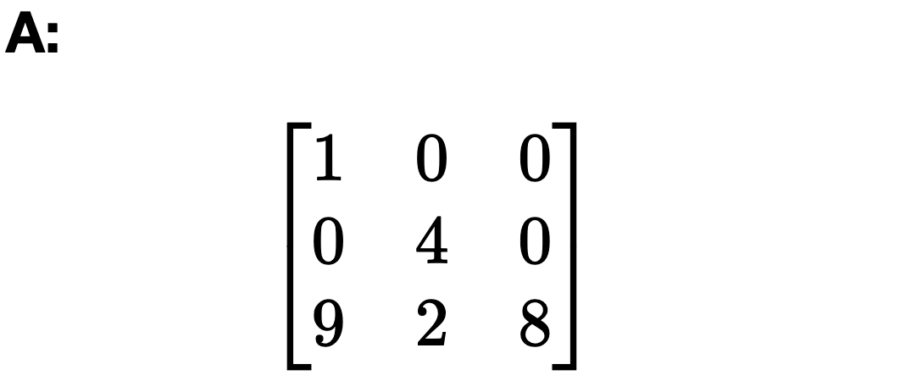
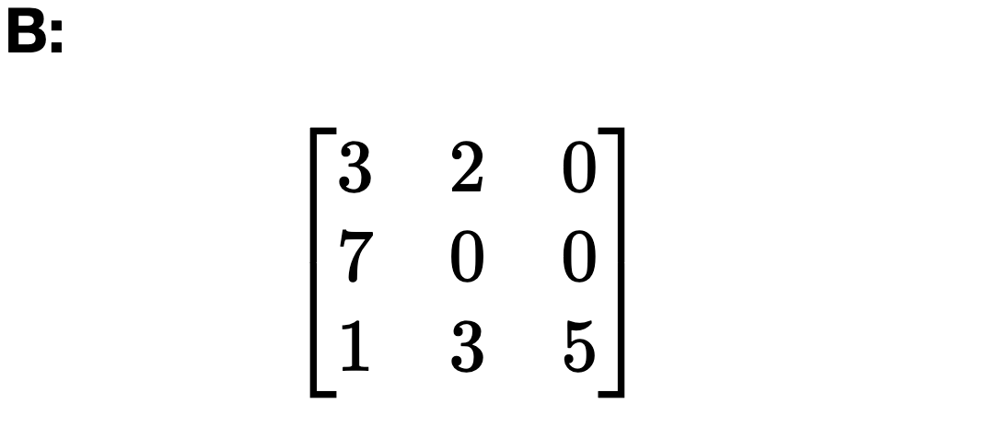
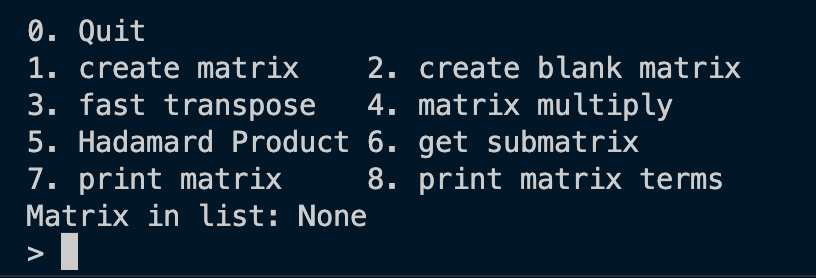
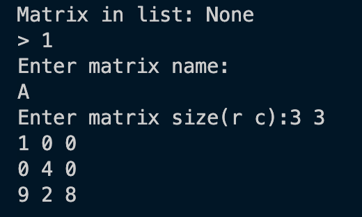
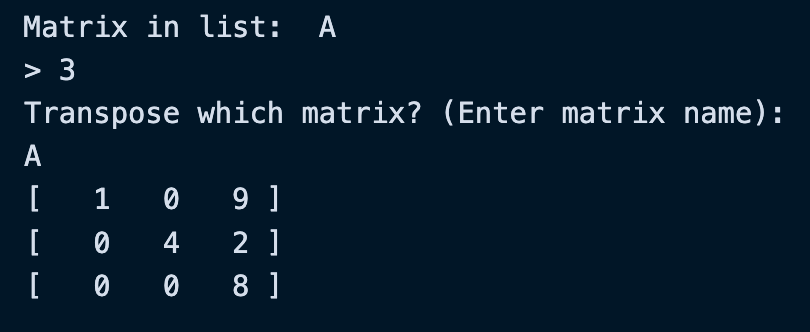
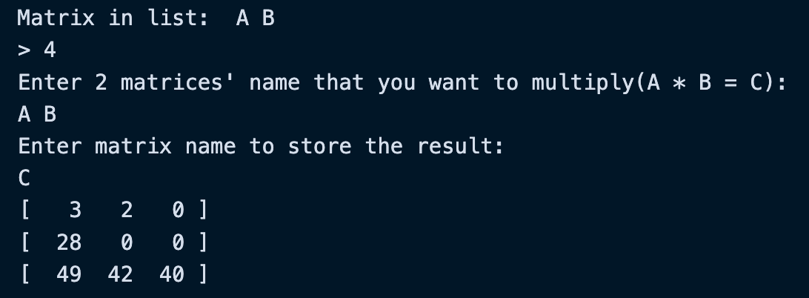
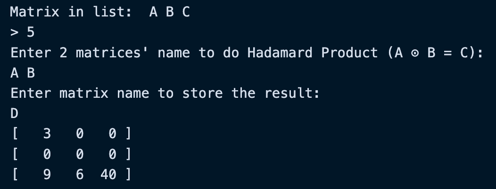
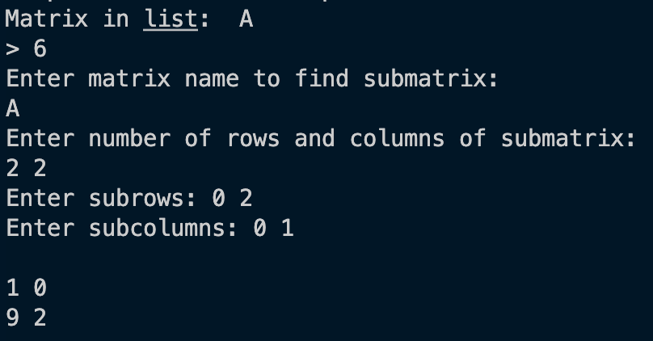
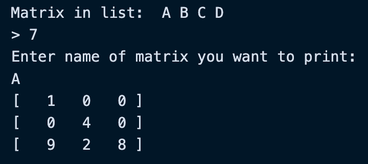
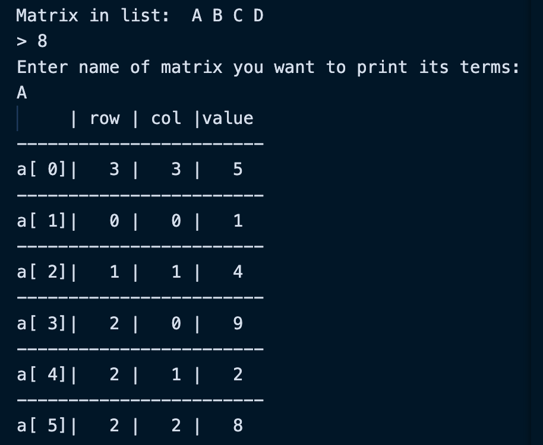

# MATRIX HW
**以下說明用矩陣A、B為例**
> * ***[Struct 宣告](#struct-宣告)***
> * ***[主要 function 功能](#主要function功能)***
> * ***[輸入格式與說明](#輸入格式與說明)***
>   * *[0. quit](#0-quit)*
>   * *[1. create matrix](#1-create-matrix)*
>   * *[2. create blank matrix](#2-create-blank-matrix)*
>   * *[3. fast transpose](#3-fast-transpose)*
>   * *[4. matrix multiply](#4-matrix-multiply)*
>   * *[5. hadamard product](#5-hadamard-product)*
>   * *[6. print submatrix](#6-get-submatrix)*
>   * *[7. print matrix](#7-print-matrix)*
>   * *[8. print terms](#8-print-terms)*
>   * *[9. matrix update](#9-matrix-update)*
> * ***[時間複雜度分析](#時間複雜度分析)***
>
  


<!-- A: -->
<!-- $$
\left[
\begin{matrix}
    1 & 0 & 0\\
    0 & 4 & 0\\
    9 & 2 & 8
\end{matrix}
\right]
$$ -->
<!-- B:
$$
\left[
\begin{matrix}
    3 & 2 & 0\\
    7 & 0 & 0\\
    1 & 3 & 5
\end{matrix}
\right]
$$ -->
---
## Struct 宣告
```c
// 課本中 sparse matrix 表示法的欄位
typedef struct{
    int r;
    int c;
    int value;
}terms;

// 存放一 matrix 中所有的非零值
typedef struct{
    terms terms[MAX_TERMS];  // MAX_TERMS = 101
}matrix
```
---
## 主要function功能
```c
matrix blank_matrix_create(int r, int c)

> 初始化一個大小為 r * c 的零矩陣
```
```c
matrix matrix_create(int r, int c)

> 初始化一個大小為 r * c 的矩陣，並由使用者輸入其中內容
```
```c
void print_matrix(matrix M)

> 傳入一矩陣並以標準形式輸出
```
```c
void print_terms(matrix M)

> 傳入一矩陣並以sparse matrix表示法輸出
```
```c
matrix fast_transpose(matrix M, int printornot)

> 傳入一矩陣並以課本演算法進行轉置並回傳結果。如 printornot = 1 則輸出轉置結果
```
```c
void print_submatrix(matrix M, int* r, int* c, int lenR, int lenC)

> 傳入一矩陣與兩個存放 subrows, subcolumns的陣列，印出submatrix
```
```c
matrix matrix_multiply(matrix A, matrix B, int printornot)

> 傳入兩個矩陣，進行乘法並回傳結果。如 printornot = 1 則輸出乘法結果
```
```c
matrix hadamard_product(matrix A, matrix B, int printornot)

> 傳入兩個矩陣，進行element wise product並回傳結果。如 printornot = 1 則輸出結果
```


---
## 輸入格式與說明
> * 直接輸入指令相對應的數字來進行該指令，如 要創建一矩陣，則輸入 1 並按 Enter 鍵  
> * Matrix in list 會顯示目前已建立的矩陣名字
> * 矩陣命名時名字長度需少於20


#### 0. quit
> 輸入 0 以結束程式
#### 1. create matrix
***[menu](#matrix-hw)*** 
> 1. 為矩陣命名
> 2. 輸入矩陣大小 $r \times c$
> 3. 輸入矩陣內元素

  

#### 2. create blank matrix
***[menu](#matrix-hw)*** 
> 1. 為矩陣命名
> 2. 輸入矩陣大小 $r \times c$。該指令會創建一大小為$r \times c$ 的零矩陣

#### 3. fast transpose
***[menu](#matrix-hw)*** 
> 1. 選取要進行轉置運算的矩陣名稱，會回傳轉置結果並輸出



#### 4. matrix multiply
***[menu](#matrix-hw)*** 
> 1. 輸入要相乘的兩個矩陣名字，名字中間用空格分開
> - 如目前 $所存的矩陣數量 < 2$ 會跳出錯誤訊息並退出執行相乘指令
> - 如兩矩陣無法相乘會跳出 「兩矩陣無法相乘」的錯誤訊息並退出執行相乘指令  
> 
> 2. 輸入要存放乘法結果的矩陣名稱
> 3. 指令會回傳並印出結果



#### 5. Hadamard product
***[menu](#matrix-hw)*** 
> 1. 輸入要進行 *element-wise-product*的兩個矩陣名字，名字中間用空格分開
> - 如兩矩陣無法進行 *element-wise-product*，則會跳出錯誤訊息並退出執行指令 
> 
> 2. 輸入要存放結果的矩陣名稱
> 3. 指令會回傳並印出結果



#### 6. get submatrix
> 1. 輸入要取子矩陣的矩陣名稱
> 2. 輸入子矩陣大小 $r * c$，中間用空格分開
> 3. 分別輸入要取得的 subrows 和 subcolumns
> 4. 輸出子矩陣


***[menu](#matrix-hw)*** 

#### 7. print matrix
> 1. 輸入要印出的矩陣名字
> 2. 印出矩陣  


***[menu](#matrix-hw)*** 

#### 8. print terms
> 1. 輸入要印出的矩陣名字
> 2. 以課本中 *sparse matrix* 表示法印出矩陣  


***[menu](#matrix-hw)*** 

#### 9. matrix update
> 1. 輸入要修改的矩陣名字
> 2. 輸入新的矩陣大小 $r \times n$
> 3. 輸入新的矩陣值
> 
***[menu](#matrix-hw)*** 


---
## 時間複雜度分析
